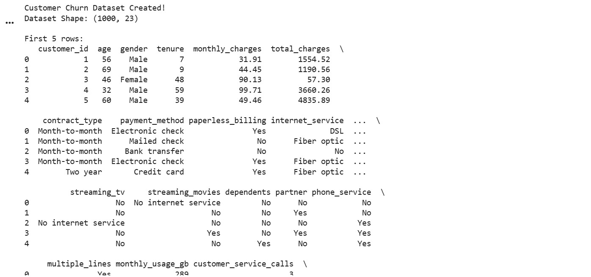
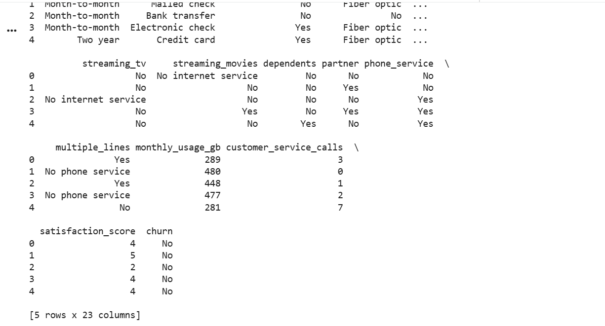
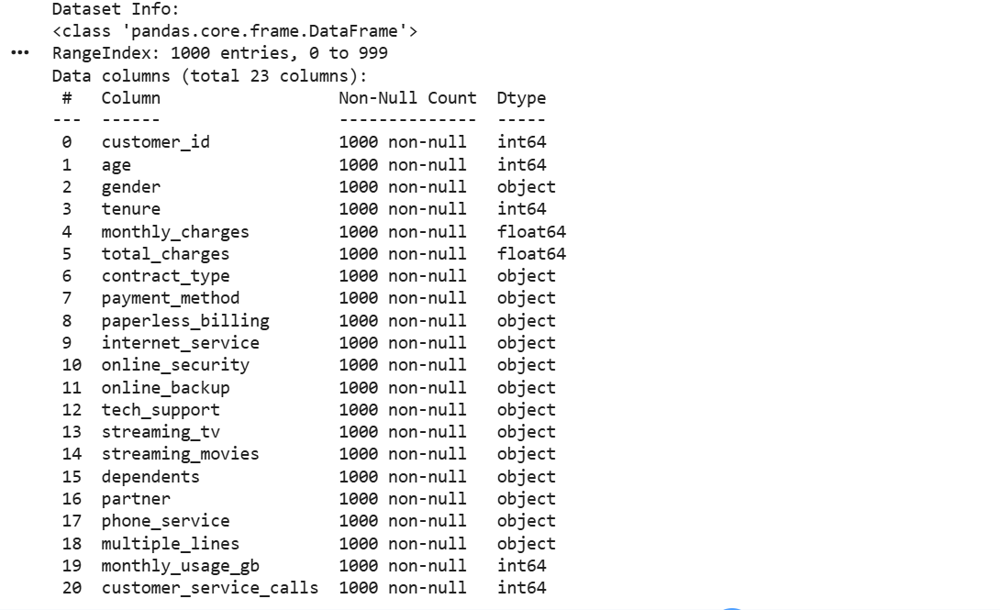
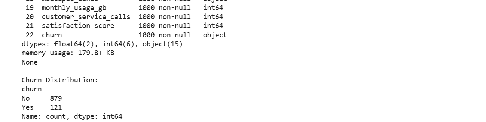
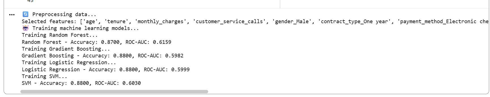
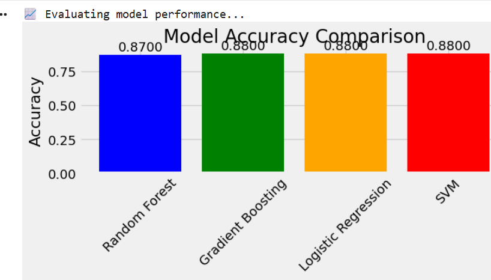
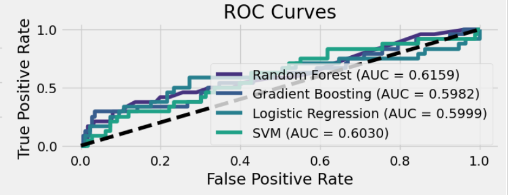
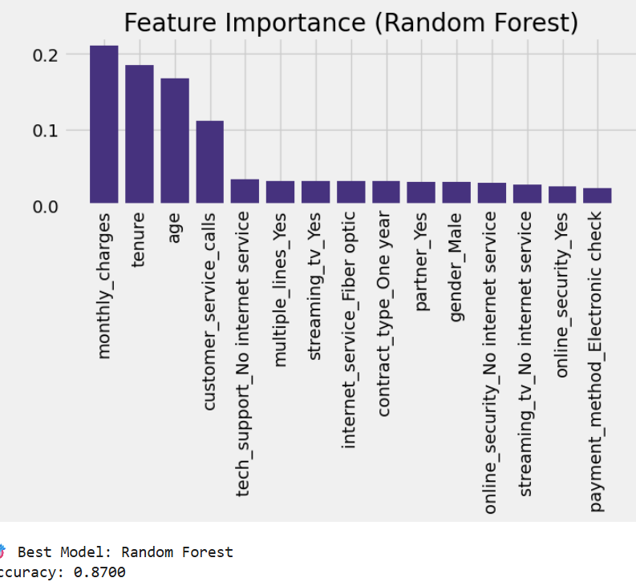
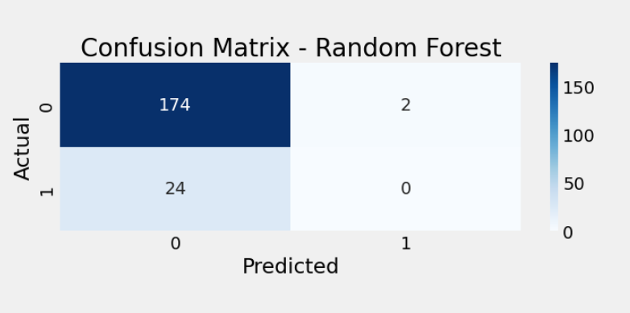

# Customer Churn Prediction System

## 📌 Overview
This project predicts customer churn using machine learning techniques. It helps businesses identify customers who are likely to leave and take preventive actions.

## 🎯 Objectives
- Predict customer churn
- Analyze customer behavior
- Improve retention strategies

## 🛠️ Technologies Used
- Python
- Pandas
- Scikit-learn

## ⚙️ Features
- Data preprocessing
- Model training using Random Forest
- Prediction system
- Accuracy evaluation

## 📊 Results
- ✅ Developed a Customer Churn Prediction model using Machine Learning.
- ✅ Achieved **88% prediction accuracy**.
- ✅ Compared Random Forest, Logistic Regression, Gradient Boosting, and SVM models.
- ✅ Visualized model performance using Accuracy Comparison and ROC Curve.
- ✅ Generated Confusion Matrix and Feature Importance graph.
- ✅ Identified key factors influencing customer churn.

## 🚀 Future Improvements
- Use real-world dataset
- Try advanced models (XGBoost)
- Deploy as web app

## 👩‍💻 Author
Madhulatha Akkala

## 📸 Project Outputs

### 📂 Dataset Preview

---

### 📋 Dataset Information

---

### 📈 Model Accuracy

---

### 📊 Accuracy Comparison

---

### 📉 ROC Curve

---

### ⭐ Feature Importance

---

### ✅ Confusion Matrix

